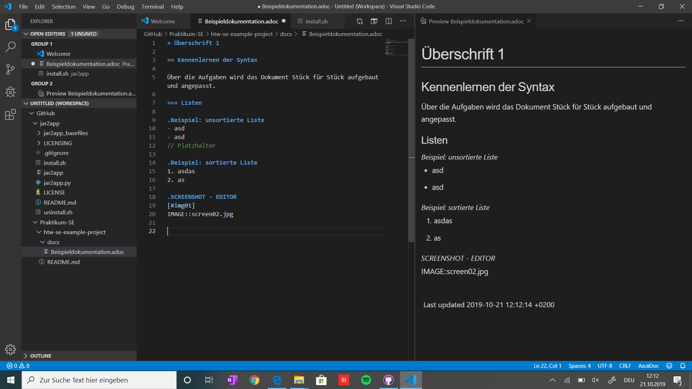

= Überschrift 1

== Kennenlernen der Syntax

Über die Aufgaben wird das Dokument Stück für Stück aufgebaut und angepasst.

=== Listen

.Beispiel: unsortierte Liste 
- asd
- asd
// Platzhalter

.Beispiel: sortierte Liste
1. asdas
2. as

.SCREENSHOT - EDITOR
[#img01]

=== Formatierung
**S**__o__ftw__a__r__e__ __**E**__ng__i__n__ee__``r__i__ng``

